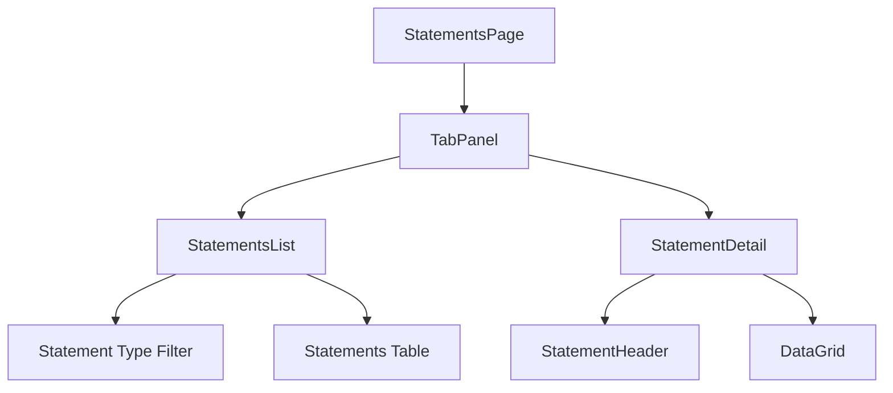
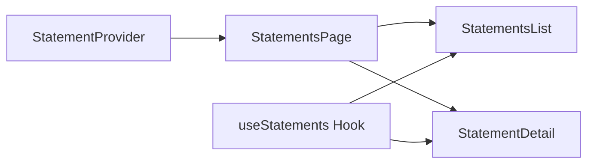

# Statement Detail View Implementation Plan

## Component Structure



## Implementation Steps

### 1. StatementsPage Component Structure

- Create main container with tab panel for list/detail views
- Add navigation drawer integration
- Implement statement type filtering
- Handle tab state management

### 2. StatementDetail Component

- Display statement metadata in header
- Configure type-specific DataGrid layouts
- Implement loading states with MUI Skeleton
- Handle empty and error states

### 3. Column Configurations

Example configuration structure:

```typescript
const columnConfigs = {
  LeumiCard: {
    תאריך_העסקה: { width: 120, headerName: "Transaction Date" },
    שם_בית_העסק: { width: 200, headerName: "Business Name" },
    סכום_העסקה: { width: 120, headerName: "Amount", type: "number" },
    מטבע_העסקה: { width: 100, headerName: "Currency" },
    סכום_החיוב: { width: 120, headerName: "Charge Amount", type: "number" },
    תאריך_החיוב: { width: 120, headerName: "Charge Date" },
    מספר_הכרטיס: { width: 150, headerName: "Card Number" },
  },
  LeumiChecking: {
    תאריך_ערך: { width: 120, headerName: "Value Date" },
    תיאור: { width: 200, headerName: "Description" },
    בחובה: { width: 120, headerName: "Debit", type: "number" },
    בזכות: { width: 120, headerName: "Credit", type: "number" },
    היתרה_בשח: { width: 120, headerName: "Balance" },
    הערה: { width: 150, headerName: "Note" },
    תאריך: { width: 120, headerName: "Date" },
    מספר_חשבון: { width: 150, headerName: "Account Number" },
  },
  MaxCard: {
    תאריך_עסקה: { width: 120, headerName: "Transaction Date" },
    שם_בית_העסק: { width: 200, headerName: "Business Name" },
    קטגוריה: { width: 120, headerName: "Category" },
    סכום_חיוב: { width: 120, headerName: "Amount", type: "number" },
    מטבע_חיוב_העסקה: { width: 100, headerName: "Currency" },
    תאריך_חיוב: { width: 120, headerName: "Charge Date" },
    ספרות_אחרונות_של_כרטיס_האשראי: { width: 150, headerName: "Card Number" },
  },
};
```

### 4. File Structure

```
src/presentation/pages/Statements/
  ├── StatementsPage.tsx         // Main container with tabs
  ├── components/
  │   ├── StatementsList.tsx     // List view of all statements
  │   ├── StatementDetail.tsx    // Detail view with DataGrid
  │   ├── StatementHeader.tsx    // Metadata display
  │   └── types.ts              // Component prop types
  └── utils/
      └── columnConfigs.ts      // Type-specific column configurations
```

### 5. Data Flow



## Error Handling

- Add error boundaries around key components
- Handle empty states with informative messages
- Validate statement data before rendering

## Styling

- Follow existing theme from theme/theme.ts
- Use MUI's styling system for consistency
- Ensure responsive layout for all screen sizes

## Development Process

1. Set up basic component structure
2. Implement statement list view
3. Add statement detail view with type-specific grids
4. Integrate navigation and tab functionality
5. Add error handling and loading states
6. Test with different statement types
7. Polish UI and ensure responsiveness
